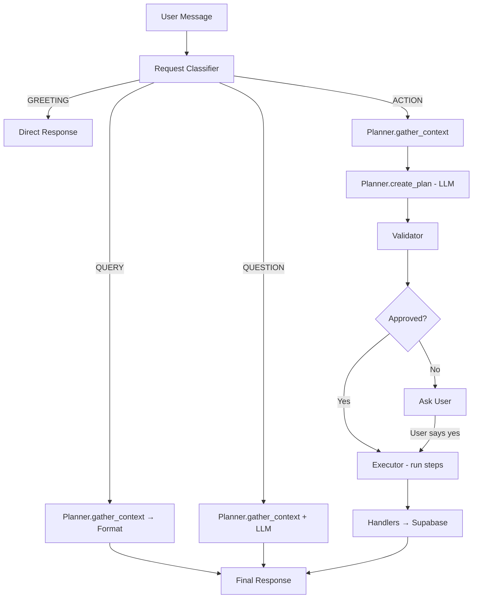

# 🍽️ Mise AI - Your Personalized Nutrition Assistant

> **Mise** (pronounced "MEEZ") - French culinary term meaning "everything in its place"

A smart AI-powered nutrition assistant that provides personalized meal suggestions, manages your food inventory, tracks leftovers, and helps reduce food waste through intelligent meal planning.


## 🌟 Key Features

### 🎯 **Personalized Meal Suggestions**

- AI analyzes your dietary preferences, restrictions, and goals
- Considers available ingredients and cooking time
- Adapts to your cultural background and family size
- Learns from your meal ratings and feedback

### 📦 **Smart Inventory Management**

- Track pantry and refrigerator contents
- Get meal suggestions based on available ingredients
- Automatic expiration tracking and reminders
- Reduce food waste through intelligent planning

### 🍜 **Leftover Optimization**

- Track leftover meals and portions
- Smart suggestions to use leftovers before they spoil
- Portion management for families
- Reduce food waste and save money

### 🛒 **Intelligent Shopping Lists**

- Auto-generate shopping lists from meal suggestions
- Track missing ingredients for recipes
- Organize by store categories
- Sync with meal planning

### ⚡ **Parallel Function Execution**

- Lightning-fast responses through simultaneous data processing
- 3-5x faster than traditional sequential AI assistants
- Comprehensive context gathering in single requests

## 🚀 How Mise Works

### **Example Interactions:**

**User:** *"What should I cook for dinner?"*

**Mise processes in parallel:**

1. `getCurrentTime` - Confirms it's dinner time
2. `getLeftovers` - Checks for existing food to use first
3. `getInventory` - Reviews available ingredients
4. `getUserPreferences` - Considers dietary restrictions & goals

**Result:** *"I see you have leftover chicken curry from yesterday (2 servings). Would you like to reheat that, or shall I suggest something fresh using your available ingredients?"*

---

**User:** *"I'm vegetarian now, and I want to eat more protein"*

**Mise responds:**

1. Detects new dietary preference
2. Asks: *"Would you like me to update your profile to vegetarian and add high-protein as a goal?"*
3. Updates preferences after confirmation
4. Suggests protein-rich vegetarian meals

## 🛠 Tech Stack

| Category | Technology |
|----------|------------|
| **Frontend** | React 18, TypeScript, Vite, Tailwind CSS |
| **UI Components** | shadcn/ui, Radix UI |
| **Backend (API)** | Python Flask (mise-asi) — orchestration, planning, execution |
| **Backend (Data)** | Supabase (PostgreSQL, Auth) |
| **AI/LLM** | Google Gemini (server-side: planning, Q&A, confirmations) |
| **Authentication** | Supabase Auth |
| **State Management** | React Hooks, Custom Hooks |
| **Deployment** | Frontend: Vercel/Render; Backend: Render (Flask) |

## 🏗 Architecture

### **Request flow**

The frontend does **not** call Gemini directly. All chat goes through the **ASI (Python) backend**:

1. User sends a message in the React app.
2. `useChat` calls **`callGeminiProxy`** → **ASI `/chat`** (Flask) with `message`, `user_id`, and optional `history`.
3. The **Orchestrator** classifies the request, then either returns a direct response, runs a query, runs an action (plan → validate → execute), or answers a question with context + LLM.

### **Request types and behavior**

| Request type | Source | Behavior |
|--------------|--------|----------|
| **GREETING** | `classifier.py` (regex) | Direct reply; no DB or LLM. |
| **QUERY** | Classifier (e.g. "show my shopping list") | **Planner** gathers context once (`gather_context`); response is formatted data only — **no LLM**. |
| **ACTION** | Classifier (e.g. "add milk to my list") | **Plan → Validate → Execute**: Planner gathers context, LLM produces a structured **action plan** (JSON steps); **Validator** checks approval/budget; **Executor** runs each step sequentially via **handlers**. |
| **QUESTION** | Classifier (e.g. "what should I cook?") | Planner gathers context; **one LLM call** with that context and the user question; no tool execution. |



### **Components**

| Component | Location | Responsibility |
|-----------|----------|----------------|
| **Request Classifier** | `orchestration/classifier.py` | Regex + rules: GREETING, QUERY (target: shopping_list / inventory / leftovers / preferences), ACTION, QUESTION. No LLM. |
| **Agent Planner** | `orchestration/planner.py` | `gather_context(user_id)` loads preferences, inventory, leftovers, shopping list from Supabase; `create_plan(message, context, TOOLS)` calls Gemini to return a JSON action plan (goal + steps with `action`, `parameters`, `description`). |
| **Agent Validator** | `orchestration/validator.py` | Validates plan (e.g. budget, safety); sets `requires_approval`; can add errors/warnings. |
| **Agent Executor** | `orchestration/executor.py` | Runs plan steps **sequentially**; each step is dispatched to **handlers** (`handle_function_call`); supports rollback for certain actions. |
| **Handlers** | `mise-asi/handlers/*.py` | Map tool names to Supabase/APIs: inventory, shopping_list, preferences, leftovers, meal, notes, amazon_search, utility. |
| **Rate Limiter** | `orchestration/rate_limiter.py` | Throttles Gemini calls to avoid quota exhaustion. |

```
┌─────────────────┐         ┌──────────────────────────────────────┐         ┌─────────────────┐
│   React (Vite)  │  POST   │  Python Flask (mise-asi)             │  API    │  Google Gemini  │
│                 │  /chat  │  • Classifier                         │  calls  │                 │
│  useChat →      │────────►│  • Orchestrator                       │────────►│  Planning       │
│  callGeminiProxy│         │  • Planner (gather_context, create_  │         │  Q&A            │
│  (asiProxy.ts)  │◄────────│    plan)                              │◄────────│  Confirmations  │
└─────────────────┘         │  • Validator / Executor               │         └─────────────────┘
         │                  │  • Handlers (function calls)          │
         │                  └──────────────────┬───────────────────┘
         │                                     │
         │                                     ▼
         │                  ┌──────────────────────────────────────┐
         │                  │  Supabase                           │
         └─────────────────►│  Auth, PostgreSQL (prefs, inventory, │
          (Supabase client) │  shopping_list, leftovers, etc.)    │
                            └──────────────────────────────────────┘
```

### **Function calling (implementation details)**

All **function execution is server-side** in the Python backend. The frontend does not receive or run Gemini tool calls; it only sends the user message and displays the final text and thought steps.

- **Tool definitions**  
  Tools are declared in **`mise-asi/registry/schemas/`** (per domain) and aggregated in **`mise-asi/registry/tools.py`**. Each tool has `name`, `description`, and `input_schema` (JSON schema). The orchestrator converts these to **Gemini `FunctionDeclaration`** format (with schema sanitization for Gemini) and passes them only to the **Planner** when calling the LLM to **create an action plan**. The LLM returns a JSON plan with `goal` and `steps`; each step has `action` (tool name), `parameters`, `description`, and `reason`.

- **Execution path**  
  For **ACTION** requests, the **Executor** runs plan steps **one after another**. For each step it builds a `FunctionCall` dict (`name`, `args`) and calls **`handle_function_call(function_call, ctx)`** in **`mise-asi/handlers/__init__.py`**, which dispatches to the right handler by name. Handlers talk to Supabase (and optionally external APIs) and return a string result. There is **no** client-side function-call loop; the frontend only sees the final assistant message and optional `thought_steps` / `function_calls` metadata.

- **Handler mapping**  
  Handlers live in **`mise-asi/handlers/`** and mirror the tool names (camelCase in API, e.g. `getCurrentTime`, `addToShoppingList`). Domains: **utility** (`getCurrentTime`), **inventory** (e.g. `getInventory`, `createInventoryItems`, `updateInventoryItem`, `deleteInventoryItem`), **shopping_list** (e.g. `getShoppingList`, `addToShoppingList`, `createShoppingListItems`, `deleteShoppingListItems`), **preferences** (e.g. `getUserPreferences`, `updateUserPreferences`, `createUserPreferences`, `updateUserPreferencesPartial`), **leftovers** (e.g. `getLeftovers`, `createLeftoverItems`, `deleteLeftoverItem`), **meal** (`suggestMeal`, `updateMealPlan`), **notes** (`updateUserNotes`), **amazon_search** (e.g. `searchAmazonProduct`, `getAmazonSearchResults`, `clearAmazonSearchCache`). The same names are used in **`src/hooks/chat/functionHandlers.ts`** for reference, but the live path is backend-only.

- **Context gathering**  
  For both QUERY and ACTION/QUESTION, context is gathered **programmatically** in **`Planner.gather_context(user_id)`**: it fetches user preferences, inventory, leftovers, and shopping list from Supabase (no LLM). That guarantees full context before planning or answering; the LLM is used only for creating the plan (ACTION) or the answer text (QUESTION).

- **API surface**  
  Flask exposes **`POST /chat`** (body: `message`, `user_id`, optional `history`); response: `text`, `function_calls`, `thought_steps`, and optionally `plan` / `awaiting_approval`. Also **`GET /health`** and **`GET /tools`** (returns list of tool names). Frontend uses **`VITE_ASI_ENDPOINT`** (default `http://localhost:8001`) to reach the backend.

## 🔧 Installation & Setup

### Prerequisites

- Node.js 18+ and npm
- Supabase account
- Google AI (Gemini) API key

### 1. Clone Repository

```bash
git clone https://github.com/OkeyAmy/mise-ai.git
cd mise-ai
```

### 2. Install Dependencies

```bash
npm install
```

### 3. Environment Setup

Create `.env.local` file:

```env
VITE_SUPABASE_URL=your_supabase_url
VITE_SUPABASE_ANON_KEY=your_supabase_anon_key
GEMINI_API_KEY=your_gemini_api_key
# ASI backend (default: http://localhost:8001)
# VITE_ASI_ENDPOINT=http://localhost:8001
# Production: point to your deployed Flask backend (e.g. Render)
# VITE_ASI_ENDPOINT=https://your-asi.onrender.com
# Production only: base URL of your deployed frontend (fixes OAuth redirect to localhost)
# VITE_APP_URL=https://your-app.onrender.com
```

For the **Python backend** (`mise-asi/`), use a `.env` in that directory with `SUPABASE_URL`, `SUPABASE_KEY`, `GEMINI_API_KEY`, `MODEL_NAME`, etc. (see `mise-asi/.env.example`).

### 4. Fix OAuth redirect after deployment (Google sign-in)

If "Sign in with Google" redirects to `http://localhost:8080` after deploying:

1. **Supabase Dashboard** → your project → **Authentication** → **URL Configuration**.
2. Set **Site URL** to your deployed frontend URL (e.g. `https://your-app.onrender.com`).
3. Under **Redirect URLs**, add your production URL(s), e.g.:
   - `https://your-app.onrender.com`
   - `https://your-app.onrender.com/**`
   Keep `http://localhost:8080/**` for local development.
4. In your deployment (e.g. Render), set env var **`VITE_APP_URL`** to that same frontend URL so auth redirects use it.

### 5. Database Setup

```bash
# Initialize Supabase
npx supabase init

# Run migrations
npx supabase db push

# Deploy edge functions
npx supabase functions deploy gemini-proxy
```

### 6. Start development

**Backend (ASI):** From `mise-asi/`, create a venv, install deps, set `.env`, then run (see `config` for `PORT`, default 8001):

```bash
cd mise-asi
python -m venv .venv
source .venv/bin/activate   # or .venv\Scripts\activate on Windows
pip install -r requirements.txt
# Set .env (SUPABASE_URL, SUPABASE_KEY, GEMINI_API_KEY, MODEL_NAME)
python main.py
```

**Frontend:** From repo root, set `VITE_ASI_ENDPOINT=http://localhost:8001` (or leave default) and run:

```bash
pnpm install
pnpm run dev
```

Visit `http://localhost:5173` (or the port Vite prints). Chat requests go to the ASI backend at `VITE_ASI_ENDPOINT`.

## 📁 Project Structure

```
mise-asi/                    # Python ASI backend (Flask)
├── adapters/
│   └── flask_app.py        # Routes: /chat, /health, /tools
├── config/                 # Settings, env
├── orchestration/
│   ├── orchestrator.py     # Classifier → GREETING/QUERY/ACTION/QUESTION
│   ├── classifier.py       # Request type + target entity
│   ├── planner.py          # gather_context, create_plan (Gemini)
│   ├── validator.py        # Plan validation, approval
│   ├── executor.py         # Run plan steps via handlers
│   ├── action_plan.py      # PlanStep, ActionPlan, AgentContext
│   └── rate_limiter.py
├── handlers/                # One module per domain
│   ├── __init__.py         # handle_function_call, FUNCTION_HANDLERS
│   ├── inventory_handlers.py
│   ├── shopping_list_handlers.py
│   ├── preferences_handlers.py
│   ├── leftovers_handlers.py
│   ├── meal_handlers.py
│   ├── notes_handlers.py
│   ├── amazon_search_handlers.py
│   └── utility_handlers.py
├── registry/
│   ├── tools.py            # TOOLS list (aggregate)
│   └── schemas/            # Tool definitions (name, description, input_schema)
│       ├── inventory_tools.py
│       ├── shopping_list_tools.py
│       ├── preferences_tools.py
│       ├── leftovers_tools.py
│       ├── meal_tools.py
│       ├── amazon_search_tools.py
│       └── ...
└── utils/                  # Supabase client, logger

src/                        # Frontend (React + Vite)
├── components/             # UI (Chatbot, InventoryManager, ShoppingList, …)
├── hooks/
│   ├── useChat.ts          # Sends message via callGeminiProxy → ASI /chat
│   └── chat/
│       ├── asiProxy.ts     # callASIProxy, callGeminiProxy (history → ASI)
│       ├── functionHandlers.ts  # Reference only; execution is backend
│       └── geminiProxy.ts   # Legacy Supabase path (optional)
├── lib/
│   ├── gemini/             # api.ts, tools.ts (used if not using ASI)
│   ├── prompts/            # systemPrompt (reference)
│   └── functions/          # Tool definitions (mirror registry/schemas)
└── integrations/
    └── supabase/           # Auth + DB client
```

## 🔥 Key Features Deep Dive

### **Context gathering (no LLM for reads)**

For **QUERY** and for **ACTION/QUESTION**, the backend gathers context **programmatically** in one go. The Planner calls Supabase for preferences, inventory, leftovers, and shopping list so the LLM always has full context without relying on the model to "decide" which tools to call. This is fast and deterministic.

### **Request-based routing**

| User intent | Classifier | What runs |
|-------------|------------|-----------|
| "Hi" / "Thanks" | GREETING | Direct reply; no DB or Gemini. |
| "What's in my shopping list?" | QUERY (target: shopping_list) | `gather_context` → format list; no LLM. |
| "Add milk and eggs to my list" | ACTION | `gather_context` → Gemini creates plan (e.g. `createShoppingListItems`) → Validator → Executor runs steps via handlers. |
| "What should I cook tonight?" | QUESTION | `gather_context` → one Gemini call with context + question; no tool execution. |

### **Action plans and execution**

For ACTIONS, Gemini is used only to **create a plan** (JSON with `goal` and `steps`). Each step has an `action` (e.g. `addToShoppingList`, `createInventoryItems`) and `parameters`. The Executor runs steps **sequentially**, calling `handle_function_call` for each; handlers perform the real Supabase/API work. High-impact or sensitive plans can require user approval before execution.

### **Contextual Meal Suggestions**

Every suggestion considers:

- ⏰ Current time (breakfast/lunch/dinner)
- 🥘 Available ingredients and quantities
- 🍽️ Existing leftovers to minimize waste
- 🎯 Personal dietary goals and restrictions
- 🌍 Cultural preferences and cuisines
- 👨‍👩‍👧‍👦 Family size and meal portions

## 🧪 Testing

### **Python Agentic Workflow**

 ```bash
 # Activate virtual environment
 source .venv/bin/activate
 
 # Run comprehensive test suite
 python test_agentic_workflow.py
 
 # Run specific integration tests
 python test_agentic_workflow.py --integration
 
 # Verify database handlers
 python test_inventory_params.py
 ```

### **Frontend Tests**

 ```bash
 # Run tests
 npm test
 
 # Run with coverage
 npm run test:coverage
 
 # E2E tests
 npm run test:e2e
 ```

## 📈 Performance

- **Initial Load**: < 2s
- **Function Execution**: 200-500ms (parallel)
- **LLM Response Time**: 1-3s
- **Database Queries**: < 100ms
- **Overall UX**: Near real-time responses

## 🤝 Contributing

1. Fork the repository
2. Create your feature branch (`git checkout -b feature/amazing-feature`)
3. Commit your changes (`git commit -m 'Add amazing feature'`)
4. Push to the branch (`git push origin feature/amazing-feature`)
5. Open a Pull Request

### Development Guidelines

- Follow TypeScript best practices
- Use semantic commit messages
- Write tests for new features
- Update documentation

## 📄 License

This project is licensed under the MIT License - see the [LICENSE](LICENSE) file for details.

## 🙏 Acknowledgments

- **Google Gemini** for advanced AI capabilities
- **Supabase** for seamless backend infrastructure
- **shadcn/ui** for beautiful, accessible components
- **Tailwind CSS** for utility-first styling

## 🔐 Security Features

- **API Key Management**: Secure server-side handling via Supabase Edge Functions
- **User Authentication**: Row-level security with Supabase Auth
- **Data Privacy**: User data isolated per account
- **Input Validation**: Sanitized function parameters
- **Rate Limiting**: Protection against API abuse

## 🌍 Multi-Cultural Support

Mise supports diverse dietary preferences and cuisines:

- **Cultural Heritage**: Nigerian, Indian, Chinese, Mediterranean, etc.
- **Dietary Restrictions**: Vegetarian, Vegan, Halal, Kosher, Gluten-free
- **Regional Ingredients**: Local availability considerations
- **Family Traditions**: Respects cultural meal patterns

## 📱 Responsive Design

- **Mobile-First**: Optimized for mobile cooking scenarios
- **Tablet Support**: Perfect for kitchen countertop use
- **Desktop Experience**: Full-featured interface for meal planning
- **PWA Ready**: Installable web app for easy access

## 🚀 Live Demo

Try Mise AI live at: [mise-ai.lovable.app](https://mise-ai.lovable.app)

### Demo Features Available

- ✅ Chat with Mise about meal preferences
- ✅ Add ingredients to your inventory
- ✅ Get personalized meal suggestions
- ✅ Track leftovers and shopping lists
- ✅ Experience parallel function execution

## 📞 Support & Community

- 🐛 **Issues**: [GitHub Issues](https://github.com/OkeyAmy/mise-ai/issues)
- 💬 **Discussions**: [GitHub Discussions](https://github.com/OkeyAmy/mise-ai/discussions)
- 📧 **Email**: <support@mise-ai.com>
- 🔗 **Live Demo**: [mise-ai.vercel.app](https://mise-ai.vercel.app)

## 🗺️ Roadmap

### 🎯 Next Release (v1.1)

- [ ] Recipe step-by-step cooking instructions
- [ ] Voice interaction support
- [ ] Nutritional analysis dashboard
- [ ] Meal photo recognition

### 🚀 Future Versions

- [ ] Social meal sharing features
- [ ] Grocery delivery API integration
- [ ] Smart kitchen appliance connectivity
- [ ] Multi-language support

---

### ⭐ Star this repository if you find it helpful

**Built with ❤️ for healthier, smarter eating**

*Mise AI - Everything in its place, every meal perfectly planned.*

**Happy cooking! 🍳**
